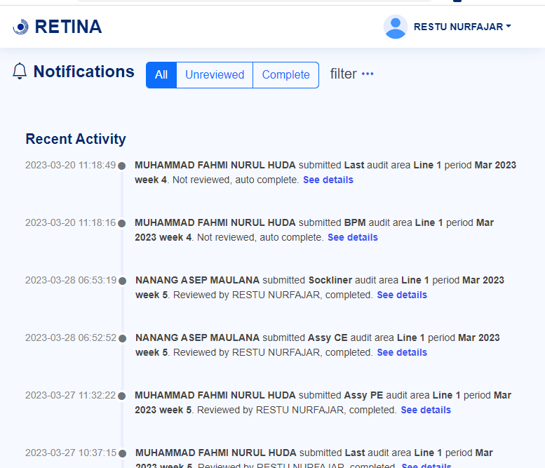

# MQAA ONLINE (AUDIT MQA)

## Description

This project digitizes Quality Management, Audit, and Assurance processes, aiming to cut down paper usage and time spent on score recaps. It enables practitioners to conduct electronic audits efficiently, streamlining planning, execution, and reporting. With detailed data recording, structured audit guidelines, and automated score summaries, it enhances efficiency and offers valuable insights for better decision-making in quality management.

⚠️ **Disclaimer**: This is not a complete project. Some code is not included and is intended solely for demonstration purposes as part of a portfolio. You can find the excluded files by checking the [.gitignore](.gitignore) file.

## Technologies Used

- **Backend**: Codeigniter 3 (RESTful), Node.js for background processes including receiving RabbitMQ messages, send notifications, and scheduling automatic audit completion
- **Frontend**: jQuery, Bootstrap
- **Database**: MySQL
- **Authentication**: JWT
- **Pagination**: SQL seek method for paginated tables
- **Event Scheduling**: RabbitMQ

## Features

- **Create Audit**: Allows the selection of an audit form, checklist completion, and the input of findings if present.
- **Get Notified**: Area leaders receive notifications indicating their area has been audited. They are required to review findings, input an action plan, and sign off.
- **Review Findings and Verification by Leader**: Enables leaders to review findings, input an action plan, and sign off.
- **Audit History and status**: Offers a comprehensive view of audit history and current status updates.
- **Follow-Up on Action Plan**: Conducts a follow-up the day after the audit to check the execution status of the action plan.
- **Set Up Area Leaders**: Configuration to designate responsible leaders for specific areas.
- **Display Summary and Scores**: Summarizes audit results, includes a database of audits, weekly scores by audit item, scores by area, weekly findings, and more.
- **Export**: Allows the export of audit summaries to Excel files.

## Screenshots

### 1. Create Audit

  
   Image 1.1. - Create audit

  
   Image 1.2. - Input finding

### 2. Get Notified

  
   Image 2.1. - Email notification

  
   Image 2.2. - Notifications page

### 3. Review Findings and Verification by Leader

  
   Image 3.1. - Input action plan

  
   Image 3.2. - Leader verification

### 4. Audit History and status

  
   Image 4. - Audit history

### 5. Follow-Up on Action Plan

  
   Image 5.1. - Audit to follow up

  
   Image 5.2. - Follow up audit

### 6. Set Up Area Leaders

  
   Image 6. - Set up area leaders

### 7. Display Summary and Scores

  
   Image 7.1. - MQA score summary

  
   Image 7.2. - MQA audit database

  
   Image 7.3. - MQA item score

  
   Image 7.4. - MQA Findings

  
   Image 7.5. - MQA BSC Score

### 8. Export

  
   Image 8. - Export as excel

## Support and Contact
For any support or feedback, please contact us at mfahmiirfan@gmail.com.
